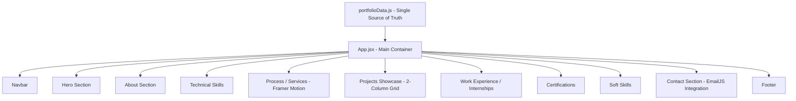

# 🚀 Sai Teja Revuri — Developer Portfolio

<div align="center">

  [](https://react.dev/)
  [](https://vitejs.dev/)
  [](https://tailwindcss.com/)
  [](https://www.framer.com/motion/)
  [](https://www.emailjs.com/)

  **A modern, high-performance, and visually captivating portfolio website built for a Data Analyst & Full Stack Developer.**

  [View Live Demo](https://github.com/saiteja9154/sai-teja-portfolio) · [Report Bug](https://github.com/saiteja9154/sai-teja-portfolio/issues) · [Request Feature](https://github.com/saiteja9154/sai-teja-portfolio/issues)

</div>

---

## 📌 Table of Contents

- [Overview](#-overview)
- [Key Features](#-key-features)
- [System Architecture](#-system-architecture)
- [Technology Stack](#-technology-stack)
- [Project Structure](#-project-structure)
- [Featured Projects Highlighted](#-featured-projects-highlighted)
- [Getting Started](#-getting-started)
  - [Prerequisites](#prerequisites)
  - [Installation](#installation)
  - [Environment Variables](#environment-variables)
  - [Running Locally](#running-locally)
  - [Building for Production](#building-for-production)
- [Customization & Configuration](#-customization--configuration)
- [Author & Contact](#-author--contact)
- [License](#-license)

---

## 🌟 Overview

This repository houses the source code for the personal portfolio of **Sai Teja Revuri**, specializing in **Data Analytics, Backend REST APIs, and Full-Stack Web Development**.

The application combines cutting-edge web design aesthetics (glassmorphism, dark/crimson palette, fluid micro-interactions, and animated SVG paths) with a clean, decoupled **data-driven architecture**. All text, external links, project lists, and skill configurations are centralized in a single state file for easy maintenance and scaling.

---

## ✨ Key Features

- **⚡ Lightning-Fast Performance**: Powered by Vite 8 with Hot Module Replacement (HMR) and optimized bundle splitting.
- **🎨 Modern Dark & Crimson Theme**: Curated dark UI with high-contrast crimson accents, glassmorphic card overlays, and subtle ambient glows.
- **📜 Interactive Scroll-Linked Process**: Framer Motion powered SVG line drawing animation that activates process milestone cards as the user scrolls.
- **📱 Responsive Projects Grid**: Optimized multi-column layout featuring a dedicated hero spotlight for flagship systems and balanced cards for full-stack and analytics projects.
- **📊 Interactive Skill Gauges**: Animated progress indicators categorizing programming languages, data science libraries, frontend frameworks, and cloud tools.
- **📨 Live Email Dispatch**: Functional contact form powered by `@emailjs/browser` with real-time feedback and validation.
- **🏆 Certificates & Internships Showcase**: Dedicated sections highlighting certifications (AWS, Google, EduSkills) and practical engineering internships.
- **🔄 Centralized Data Architecture**: Modular data configuration (`src/data/portfolioData.js`) allowing content updates without touching JSX structures.

---

## 🏛 System Architecture

The application adopts a **component-driven, unidirectional data flow** architecture.



### Component Hierarchy & Interaction Flow
1. **State & Content Layer (`src/data/portfolioData.js`)**: Exports strongly structured arrays and objects representing profile info, skills, projects, certifications, and API configurations.
2. **Presentation Layer (`src/components/`)**: Functional, atomic React components designed with Tailwind CSS utility classes and AOS/Framer Motion hooks.
3. **External Services Layer**: EmailJS API client for asynchronous message delivery directly from the browser runtime.

---

## 🛠 Technology Stack

### Frontend & Core
| Technology | Version | Purpose |
| :--- | :--- | :--- |
| **React** | `^19.2.6` | Component-based user interface library |
| **Vite** | `^8.0.12` | Next-generation frontend build tool and dev server |
| **JavaScript (ES6+)** | Modern | Core programming language |

### Styling & Animation
| Tool | Version | Purpose |
| :--- | :--- | :--- |
| **Tailwind CSS** | `^4.3.0` | Utility-first CSS framework for modern, responsive styling |
| **@tailwindcss/vite** | `^4.3.0` | Official Vite plugin for Tailwind CSS v4 compiler integration |
| **Framer Motion** | `^12.40.0` | Motion library for complex SVG scroll-progress and spring physics |
| **AOS (Animate On Scroll)** | `^2.3.4` | Viewport-triggered reveal animations |

### Services & Tooling
| Tool | Version | Purpose |
| :--- | :--- | :--- |
| **@emailjs/browser** | `^4.4.1` | Client-side email API service integration |
| **ESLint** | `^10.3.0` | Code linting and style enforcement |

---

## 📂 Project Structure

```
sai-teja-portfolio/
├── public/
│   ├── favicon.ico                   # Browser favicon
│   └── Sai_Teja_Revuri_Resume.pdf    # Downloadable resume document
├── src/
│   ├── assets/                       # Static media assets (profile images, graphics)
│   ├── components/                   # Modular React components
│   │   ├── About.jsx                 # About me & background details
│   │   ├── Certificates.jsx          # Professional certifications showcase
│   │   ├── Contact.jsx               # Contact form with EmailJS integration
│   │   ├── Footer.jsx                # Site footer, credentials, and social links
│   │   ├── Hero.jsx                  # Hero landing banner with CTA buttons
│   │   ├── Internships.jsx           # Virtual internships & work experience
│   │   ├── Navbar.jsx                # Responsive floating header navigation
│   │   ├── Preloader.jsx             # Animated brand splash loader
│   │   ├── Projects.jsx              # Responsive 2-column project showcase
│   │   ├── Services.jsx              # Framer Motion animated workflow/process
│   │   ├── SoftSkills.jsx            # Core personal and problem-solving competencies
│   │   └── TechnicalSkills.jsx       # Categorized skill meters and tech stack
│   ├── data/
│   │   └── portfolioData.js          # Centralized configuration and content state
│   ├── App.css                       # Additional styling animations & utilities
│   ├── App.jsx                       # Master page layout component
│   ├── index.css                     # Tailwind CSS directives & global rules
│   └── main.jsx                      # React 19 application entry point
├── .gitignore
├── eslint.config.js                  # ESLint configuration
├── index.html                        # HTML5 template with SEO metadata
├── package.json                      # Project dependencies and script commands
├── vite.config.js                    # Vite configuration
└── README.md                         # Project documentation
```

---

## 💼 Featured Projects Highlighted

| # | Project | Category | Tech Stack | Highlights |
| :-: | :--- | :--- | :--- | :--- |
| **01** | **Clinic Patient Record System** *(Flagship)* | Full-Stack Healthcare | React, Flask, SQLite, Tailwind CSS, REST APIs | Secure patient records, prescription tracking, modular SQLite schema |
| **02** | **AI SQL Query Generator** | AI & Database Automation | Python, SQL, REST APIs, Automation | Translates natural language queries to multi-table SQL queries |
| **03** | **SQL Sense AI** | Developer Assistant | Python, SQL, REST APIs, AI Assistant | Interactive schema parsing and step-by-step query logic execution |
| **04** | **SQL Sales Analytics Engine** | Analytics & BI | SQL, Power BI, Python, Excel | Multi-hub data extraction, CTE aggregation, and interactive dashboards |
| **05** | **HireFlow: Full-Stack Job Portal** | Full-Stack Platform | React, FastAPI, MySQL, JWT, Tailwind CSS | Role-based recruiter/candidate portal with resume processing |

---

## 🚀 Getting Started

### Prerequisites

Ensure you have the following installed on your machine:
- **Node.js** (`v18.0.0` or higher recommended)
- **npm** or **yarn** / **pnpm**
- **Git**

### Installation

1. **Clone the repository:**
   ```bash
   git clone https://github.com/saiteja9154/sai-teja-portfolio.git
   cd sai-teja-portfolio
   ```

2. **Install project dependencies:**
   ```bash
   npm install
   ```

### Environment Variables

To configure the dynamic contact form using EmailJS, create a `.env` file in the root directory:

```env
VITE_EMAILJS_SERVICE_ID=your_service_id_here
VITE_EMAILJS_TEMPLATE_ID=your_template_id_here
VITE_EMAILJS_PUBLIC_KEY=your_public_key_here
```

*(If environment variables are omitted, default fallback placeholders defined in `portfolioData.js` will be used.)*

### Running Locally

Start the local development server with Vite:

```bash
npm run dev
```

Open your browser and navigate to `http://localhost:5173` to explore the site with instant Hot Module Replacement.

### Building for Production

Compile and bundle the optimized static assets:

```bash
npm run build
```

Preview the production build locally:

```bash
npm run preview
```

---

## ⚙️ Customization & Configuration

All site content is decoupled from UI logic. To update your portfolio:

1. Open [`src/data/portfolioData.js`](file:///c:/Users/steja/OneDrive/Desktop/sai%20teja-portfolio/Portfolio/src/data/portfolioData.js).
2. Edit any section:
   - `personalInfo`: Name, titles, contact email, resume link.
   - `socialLinks`: GitHub, LinkedIn, social profiles.
   - `heroContent` & `aboutContent`: Bio text and taglines.
   - `skillsContent`: Process cards and workflow descriptions.
   - `technicalSkills`: Skill categories and percentage proficiencies.
   - `projects`: Project titles, descriptions, badges, tags, and repo URLs.
   - `certificates` & `internshipsList`: Credentials and experience records.

Save the file and your portfolio updates instantly across all sections!

---

## 👨‍💻 Author & Contact

**Sai Teja Revuri**
- **Role:** Data Analyst & Full Stack Developer
- **Education:** B.Tech in CS & AI (CGPA 7.9), Kakinada Institute of Engineering and Technology
- **GitHub:** [@saiteja9154](https://github.com/saiteja9154)
- **LinkedIn:** [Sai Teja Revuri](https://linkedin.com/in/sai-teja-revuri-97b63732a)
- **Email:** [steja9759@gmail.com](mailto:steja9759@gmail.com)

---

## 📄 License

This project is licensed under the **MIT License** — feel free to use it as inspiration or a template for your own developer portfolio.

<div align="center">
  <sub>Built with ❤️ by <a href="https://github.com/saiteja9154">Sai Teja Revuri</a></sub>
</div>
